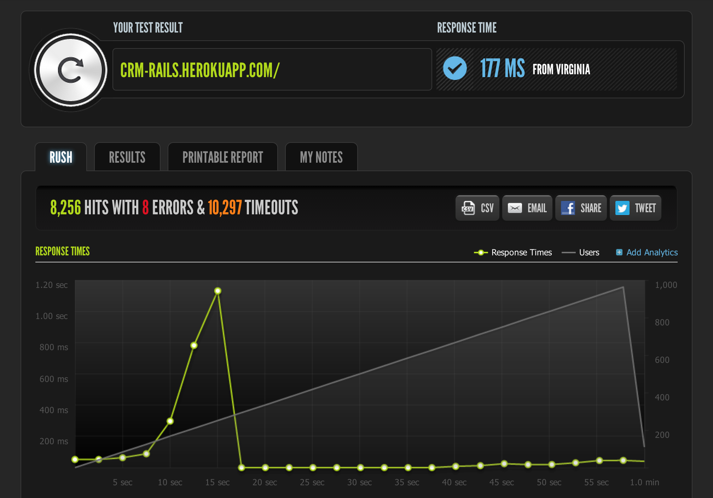
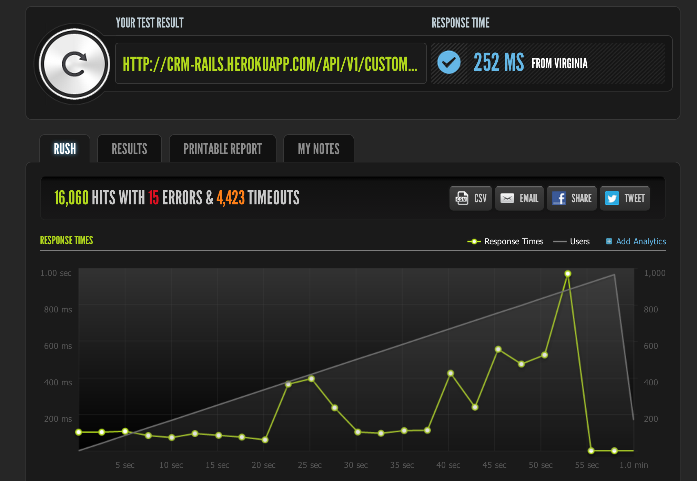
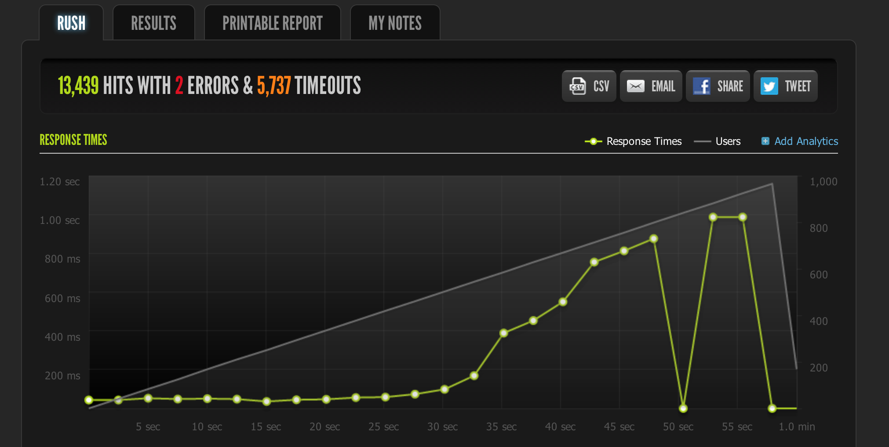
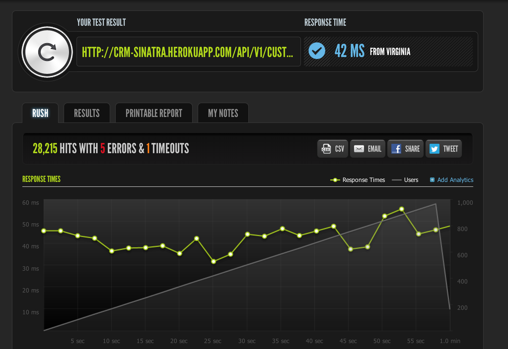
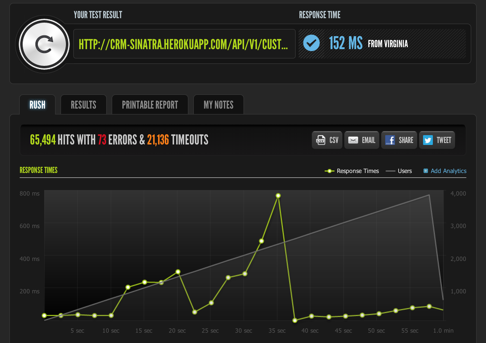
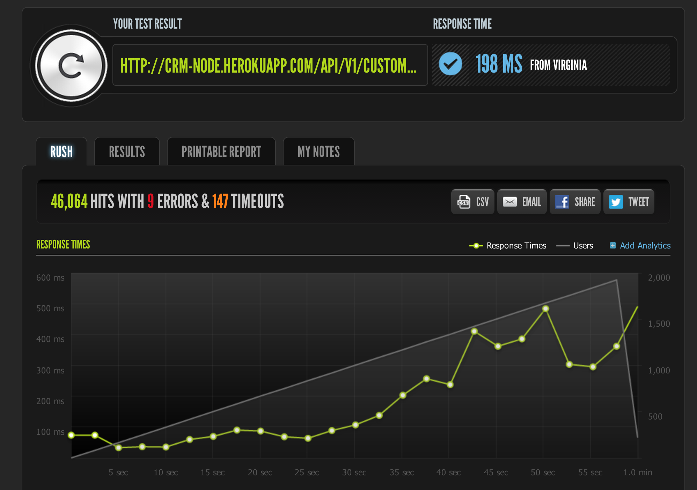
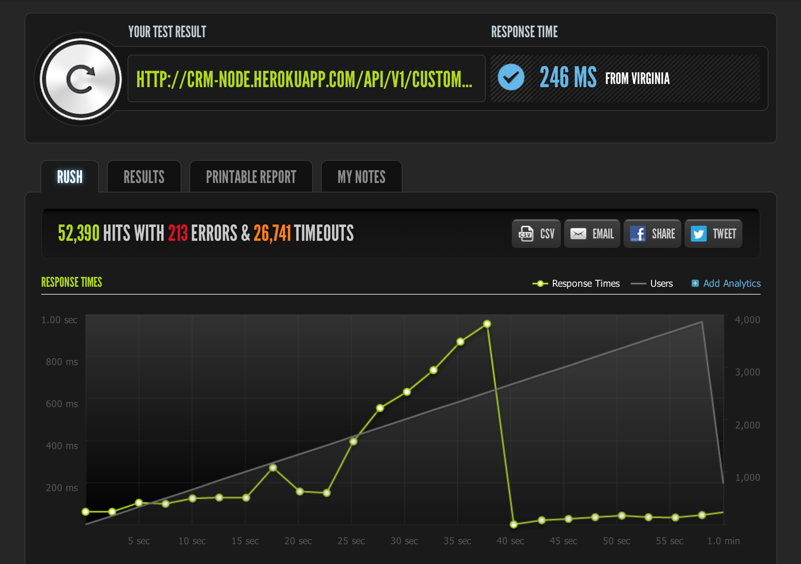

CRM Perf
========

A demo CRM for my talk on "The Thick Front-End".

There are 5 applications in this series:

* [CRM Rails](http://github.com/dickeyxxx/crm_rails). A standard Rails app with no ajax and an API. Shows the baseline of how most apps are developed today.
* [CRM Rails-jQuery](http://github.com/dickeyxxx/crm_rails_jquery). A fork of CRM Rails that uses basecamp-style ajax.
* [CRM Angular](http://github.com/dickeyxxx/crm_angular). An Angular.js app that interfaces to either CRM Rails or CRM node.js.
* [CRM node.js](http://github.com/dickeyxxx/crm_node). A drop-in replacement for the CRM Rails API written in node.js.
* [CRM Scala](http://github.com/dickeyxxx/crm_scala). A drop-in replacement for the CRM Rails API written in Scala with Play.

Back-End Performance Results
============================

DO NOT READ TOO MUCH INTO THESE. This was just me playing around writing super
contrived applications. You should try these experiments (and more!) yourself to
determine what the right stack for your application is. I'm not trying to prove
a point about anything here, just having fun.

Results
-------

| Framework                         | Database   | Notes  | Hits  | Response Time |
| --------------------------------- | ---------- | ------ | ----- | ------------- |
| Rails (Webrick)                   | PostgreSQL | HTML   | 5814  | 199ms         |
| Rails (Thin)                      | PostgreSQL | HTML   | 8256  | 177ms         |
| Rails (Webrick)                   | PostgreSQL |        | 5722  | 278ms         |
| Rails (Thin)                      | PostgreSQL |        | 6525  | 431ms         |
| Rails (unicorn 3x)                | PostgreSQL |        | 16060 | 252ms         |
| Rails (unicorn 4x)                | PostgreSQL |        | 13439 | 315ms         |
| Rails (Thin)                      | MongoDB    | no orm | 4875  | 560ms         |
| Sinatra (Thin)                    | MongoDB    | no orm | 12455 | 234ms         |
| Sinatra (unicorn 10x, 1000 users) | MongoDB    | no orm | 28215 | 42ms          |
| Sinatra (unicorn 10x, 2000 users) | MongoDB    | no orm | 46286 | 205ms         |
| Sinatra (unicorn 10x, 4000 users) | MongoDB    | no orm | 65494 | 152ms         |
| Sinatra (unicorn 20x, 5000 users) | MongoDB    | no orm | 65907 | 291ms         |
| node.js                           | PostgreSQL |        | 26080 | 100ms         |
| node.js (1000 users)              | MongoDB    |        | 27304 | 71ms          |
| node.js (2000 users)              | MongoDB    |        | 46064 | 198ms         |
| node.js (4000 users)              | MongoDB    |        | 52390 | 246ms         |
| Scala/Play                        | MongoDB    |        | 25811 | 68ms          |
| Scala/Play (4000 users)           | MongoDB    |        | 84012 | 60ms          |

Notes
-----

* anything not marked as 'HTML' was hitting `api/v1/customers.json`.
* node.js tests never used an orm
* It's very interesting that rails + mongo was slower than rails + pg since you'd think mongo would be faster, and that there was no ORM with mongo. This was repeatable too.

blitz.io
--------

[Rails (Webrick) + PostgreSQL + HTML](https://www.blitz.io/report/dd5557fe3122f5542d33807c4d43064b)

[Rails (Thin) + PostgreSQL + HTML](https://www.blitz.io/report/dd5557fe3122f5542d33807c4d826410)

[Rails (Webrick) + PostgreSQL](https://www.blitz.io/report/dd5557fe3122f5542d33807c4de38308)

[Rails (Thin) + PostgreSQL](https://www.blitz.io/report/dd5557fe3122f5542d33807c4de3086a)

[Rails (unicorn 3x) + MongoDB](https://www.blitz.io/report/dd5557fe3122f5542d33807c4d8256ff)

[Rails (unicorn 4x) + MongoDB](https://www.blitz.io/report/dd5557fe3122f5542d33807c4de2283c)

[Rails (Thin) + MongoDB](https://www.blitz.io/report/dd5557fe3122f5542d33807c4d42e374)

[Sinatra (thin) + MongoDB](https://www.blitz.io/report/dd5557fe3122f5542d33807c4d81e072)

[Sinatra (unicorn 10x) + MongoDB](https://www.blitz.io/report/dd5557fe3122f5542d33807c4de20966)

[Sinatra (unicorn 10x 2000 users) + MongoDB](https://www.blitz.io/report/dd5557fe3122f5542d33807c4de20097)

[Sinatra (unicorn 10x 4000 users) + MongoDB](https://www.blitz.io/report/dd5557fe3122f5542d33807c4d41c1a4)

[Sinatra (unicorn 20x 5000 users) + MongoDB](https://www.blitz.io/report/dd5557fe3122f5542d33807c4d81bd5c)

[node.js + PostgreSQL](https://www.blitz.io/report/dd5557fe3122f5542d33807c4de36ccb)

[node.js + MongoDB 1000 users](https://www.blitz.io/report/dd5557fe3122f5542d33807c4d637839)

[node.js + MongoDB 2000 users](https://www.blitz.io/report/dd5557fe3122f5542d33807c4d819619)

[node.js + MongoDB 4000 users](https://www.blitz.io/report/dd5557fe3122f5542d33807c4de1e980)

[Scala (Play) + MongoDB 1000 users](https://www.blitz.io/report/dd5557fe3122f5542d33807c4d62e6f2)

[Scala (Play) + MongoDB 4000 users](https://www.blitz.io/report/dd5557fe3122f5542d33807c4de1dbb9)

