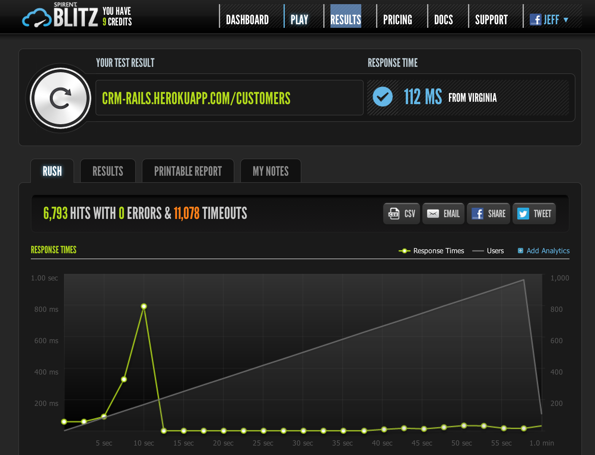
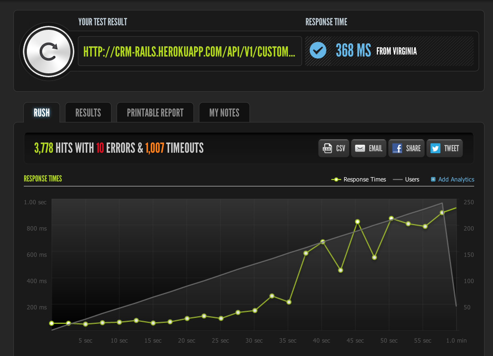
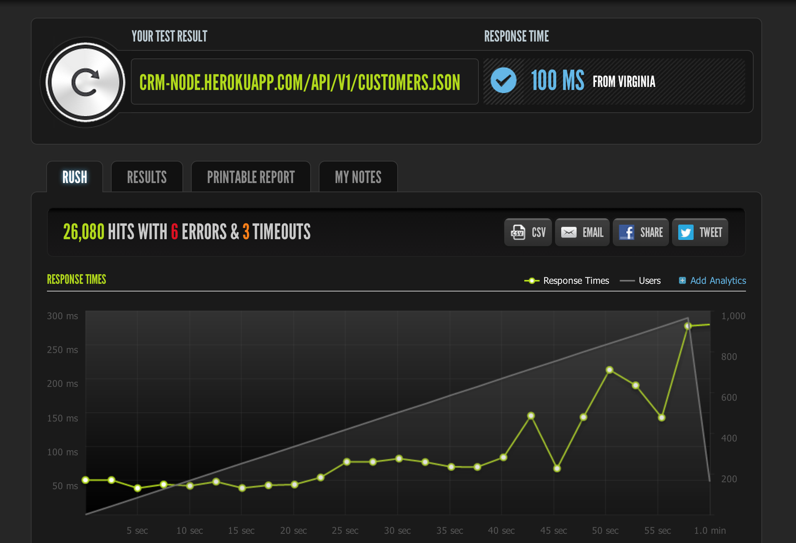
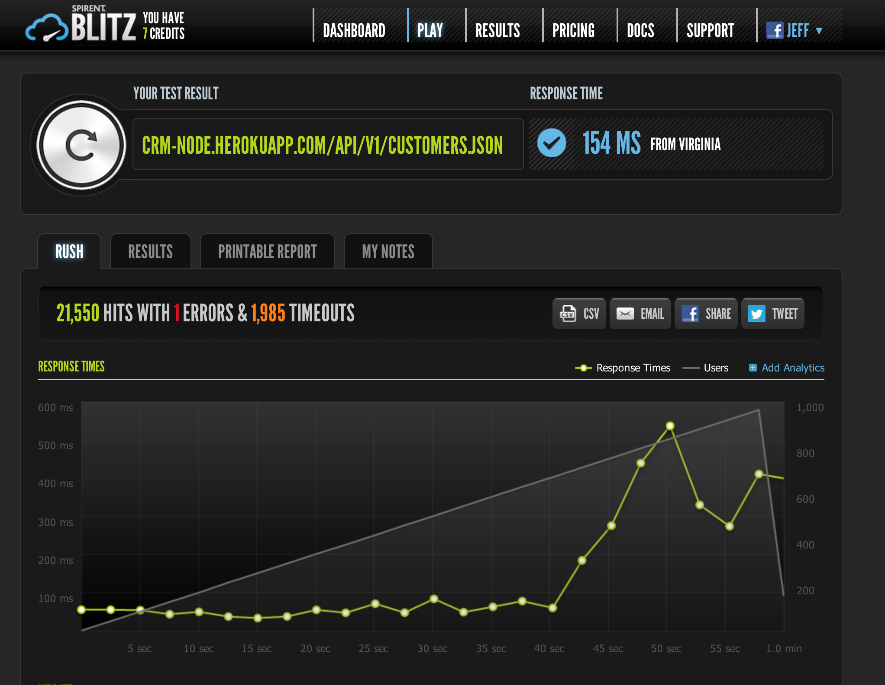

CRM Perf
========

A demo CRM for my talk on "The Thick Front-End".

There are 4 applications in this series:

* [CRM Rails](http://github.com/dickeyxxx/crm_rails). A standard Rails app with no ajax and an API. Shows the baseline of how most apps are developed today.
* [CRM Rails-jQuery](http://github.com/dickeyxxx/crm_rails_jquery). A fork of CRM Rails that uses basecamp-style ajax.
* [CRM Angular](http://github.com/dickeyxxx/crm_angular). An Angular.js app that interfaces to either CRM Rails or CRM node.js.
* [CRM node.js](http://github.com/dickeyxxx/crm_node). A drop-in replacement for the CRM Rails API written in node.js.

Back-End Performance Results
============================

[Rails + PostgreSQL + HTML](https://www.blitz.io/report/dd5557fe3122f5542d33807c4d43064b)

[Rails + PostgreSQL](https://www.blitz.io/report/dd5557fe3122f5542d33807c4de38308)

Rails + MongoDB

node.js + PostgreSQL

[node.js + MongoDB](https://www.blitz.io/report/14700fa0c283368a02ee6b23dc89ac8b)

TODO
====

* API documentation
* Scala
